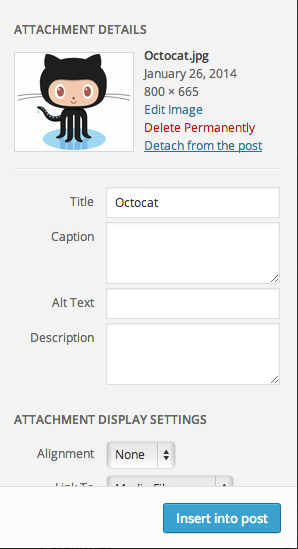

# Wordpress Remove Post Attachment

Adds a "detach from post" link on attachments so you can remove it from the post without deleting the file.

## Installation

[Download the plugin](https://github.com/romainberger/wordpress-remove-post-attachment/archive/master.zip), rename the archive to `wordpress-remove-post-attachment` and upload it on your website like any other plugin.

Also available [on the wordpress site](http://wordpress.org/plugins/remove-post-attachment/).

## Compatibility

The plugin has been tested and works with Wordpress 3.7 and above.

Wordpress doesn't give a simple way to add links in the media lightbox, so this plugin does its thing in a pretty hacky way. If it stops working or if you see any issue, please create an issue precising the Wordpress version you're using.

# License

MIT
